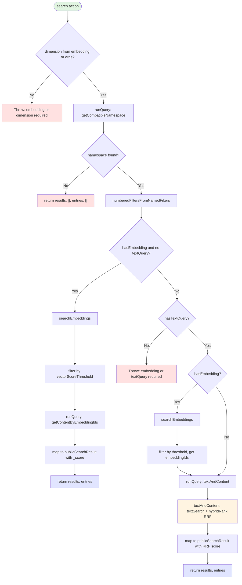

# Search flow

Flowcharts for the search action logic in `src/component/search.ts`.

## Main search action

```mermaid
flowchart TD
    Start(["search action"]) --> ValidateDim{"dimension from embedding or args?"}
    ValidateDim -->|No| ErrDim["Throw: embedding or dimension required"]
    ValidateDim -->|Yes| GetNs["runQuery: getCompatibleNamespace"]

    GetNs --> HasNs{"namespace found?"}
    HasNs -->|No| Empty["return results: [], entries: []"]
    HasNs -->|Yes| NumFilters["numberedFiltersFromNamedFilters"]

    NumFilters --> VectorOnly{"hasEmbedding and no textQuery?"}
    VectorOnly -->|Yes| VecSearch["searchEmbeddings"]
    VecSearch --> VecThresh["filter by vectorScoreThreshold"]
    VecThresh --> GetContent1["runQuery: getContentByEmbeddingIds"]
    GetContent1 --> MapVec["map to publicSearchResult with _score"]
    MapVec --> ReturnVec["return results, entries"]

    VectorOnly -->|No| NeedText{"hasTextQuery?"}
    NeedText -->|No| ErrText["Throw: embedding or textQuery required"]
    NeedText -->|Yes| MaybeVec{"hasEmbedding?"}

    MaybeVec -->|Yes| VecSearch2["searchEmbeddings"]
    VecSearch2 --> VecThresh2["filter by threshold, get embeddingIds"]
    VecThresh2 --> TextContent["runQuery: textAndContent"]
    MaybeVec -->|No| TextContent

    TextContent --> Hybrid["textAndContent: textSearch + hybridRank RRF"]
    Hybrid --> MapHybrid["map to publicSearchResult with RRF score"]
    MapHybrid --> ReturnHybrid["return results, entries"]

    style Start fill:#e1f5e1
    style Empty fill:#ffe1e1
    style ReturnVec fill:#e1e5ff
    style ReturnHybrid fill:#e1e5ff
    style ErrDim fill:#ffe1e1
    style ErrText fill:#ffe1e1
    style Hybrid fill:#fff4e1
```

## textAndContent and textSearchImpl

```mermaid
flowchart TD
    subgraph TC["internal.search.textAndContent"]
        TC_Start(["textAndContent"]) --> ResolveVec["Resolve embeddingIds to vectorContentIds"]
        ResolveVec --> TextImpl["textSearchImpl to textContentIds"]
        TextImpl --> RRF["hybridRank RRF with vectorWeight, textWeight"]
        RRF --> Slice["slice to limit"]
        Slice --> Zero{"mergedContentIds.length?"}
        Zero -->|0| RetEmpty["return empty results, entries, resultCount 0"]
        Zero -->|>0| GetDocs["get content docs by id"]
        GetDocs --> GetEntries["get entry docs, publicEntry"]
        GetEntries --> RetFull["return results, entries, resultCount"]
    end

    subgraph TS["textSearchImpl"]
        TS_Start(["textSearchImpl"]) --> Ready["filter content.state.kind is ready"]
        Ready --> NoFilt{"filters.length is 0?"}
        NoFilt -->|Yes| SearchSimple["query content with searchableText index, eq namespaceId"]
        NoFilt -->|No| LoopFilters["for each filter: filterFieldsFromNumbers"]
        LoopFilters --> SearchFiltered["query with searchableText + eq filter fields"]
        SearchFiltered --> Merge["merge by contentId, dedupe, slice to limit"]
        SearchSimple --> ToResults["toResults: contentId, entryId"]
        Merge --> ToResults
    end

    style TC_Start fill:#e1f5e1
    style RetEmpty fill:#ffe1e1
    style RetFull fill:#e1e5ff
    style RRF fill:#fff4e1
```
